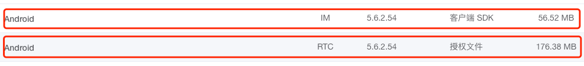
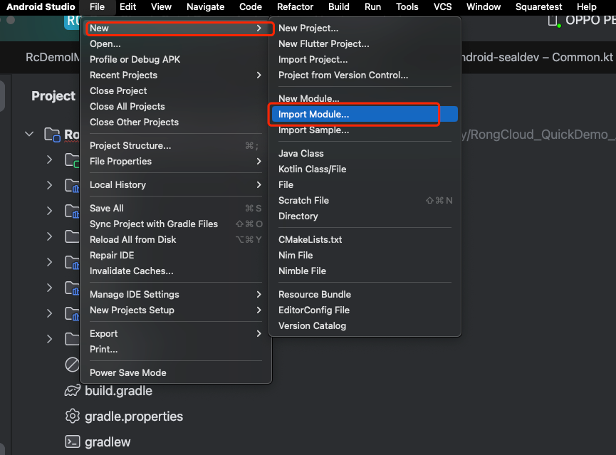
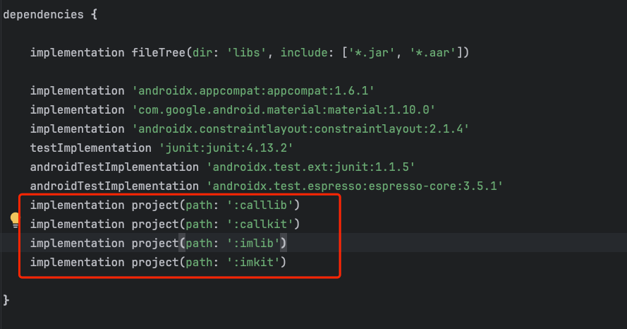
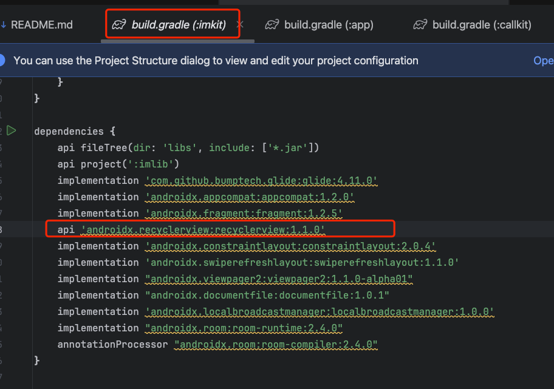
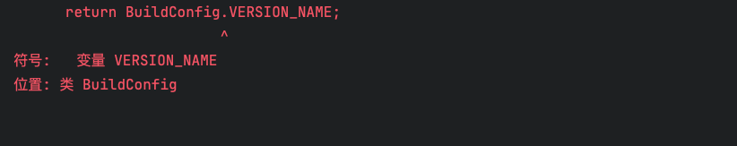
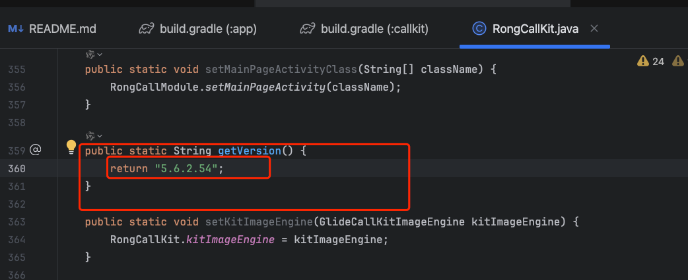

## 下载 SDK 包

### 1.在 [portal](https://eportal.rongcloud.cn/#/login) portal 下载您需要的 SDK 包。



### 2.解压 SDK 包。

## 导入 SDK 到工程中

### 1.准备 Android 开发环境。

#### 如果您已经有 Android 开发环境，可以跳过此步骤。

#### 如果您还没有 Android 开发环境，可以参考以下文档安装 Android 开发环境。

[Android 开发环境搭建](https://developer.android.com/studio/index.html)

### 2.将 SDK 以 Module 导入到您的工程中。



#### 注意：如果您只需要 IM 基础能力，您只需要导入imlib 模块。 
#### 注意：如果您需要 IM 基础能力跟UI组件，您需要导入imlib 、 imkit 模块。 
#### 注意：如果您需要 RTC 基础能力，您需要导入imlib 、rtclib 模块。 
#### 注意：如果您需要 '音视频通话' 基础能力，您需要导入imlib 、rtclib 、calllib模块。 
#### 注意：如果您需要 '音视频通话' 基础能力以及 UI 组件，您需要导入imlib 、rtclib 、calllib 、imkit 、callkit模块。 

### 3.主 Module 引用 SDK 模块。



### 4.运行 app 如果遇到 callkit 模块找不到 imkit 资源引用的问题，是因为 模块之间R类传递属性被关闭引起的问题（高版本Android Studio 默认是关闭的） 请参考如下解决方式。
  
#### 在主工程的 gradle.properties 文件中修改 如下属性为 false 再运行 app。

```groovy
    android.nonTransitiveRClass=false
   ```

### 5.运行 app 如果遇到 callkit 模块 报如下错误的问题：
  ```java
    //  找不到如下类文件
androidx.recyclerview.widget.RecyclerView
   ```

#### 请参考如下解决方案：

   、、 将 imkit 模块中的 'recyclerview' 依赖改成 api。、、



### 6.运行 app 如果遇到 callkit 模块 报如下错误的问题：



#### 请参考如下解决方案：

   、、先将您的主 callkit 模块中的 BuildConfig.VERSION_NAME 改成 您下载的SDK版本号，运行成功后再改成 BuildConfig.VERSION_NAME 、、



### 7.使用 IM 模块发送，接收消息：

[ imkit 模块详细步骤可以参考](https://doc.rongcloud.cn/im/Android/5.X/ui/init)
[ imlib 模块详细步骤可以参考](https://doc.rongcloud.cn/im/Android/5.X/noui/init)

### 8.使用 音视频通话 模块发起，接听 音视频通话：

[ callkit 模块详细步骤可以参考](https://doc.rongcloud.cn/call/Android/5.X/callkit/init)
[ calllib 模块详细步骤可以参考](https://doc.rongcloud.cn/call/Android/5.X/calllib/init)


## 注意：

1.如果您的 CA 证书不是正式的，如果报Https 签名错误，您可以参考 如下方法：

 ```java
    //  注意 要在 init 之前调用
com.rongcloud.demo.TestApp.setSSL
   ```


